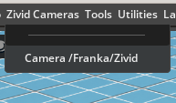

# Zivid 3D Cameras extension

This is the official Isaac Sim extension for [Zivid 3D cameras](https://www.zivid.com/).

This extension adds the ability to add realistic simulations of Zivid 3D
cameras to your simulation with correct dimensions, masses and camera
intrinsics.

> [!WARNING]
> This is a highly experimental extension which is still in development. There
> are known and unknown bugs and the presented API and GUI will most likely
> change drastically as we improve.

![Zivid Image][header-image]

## Installation

As this is an extension to Isaac Sim you need a working Isaac Sim
[installation]. The minimum version is 4.5.0.

1. Clone this repository:

    ```sh
    git clone https://github.com/zivid/zivid-isaac-sim
    ```

2. Follow the [official instructions] on how to install and enable extensions
   in Isaac Sim.

## Getting started

After enabling the extension the "Create" menu in the top menu bar offering to
add a Zivid camera and two Zivid calibration boards to the scene. Additionally
one can right-click on a prim in the tree to add a Zivid Camera to a prim.
Intended to be used for adding a camera to a robot, this will only be available
when right-clicking on a rigid body prim which has a parent or ancestor with
articulation.

When adding a Zivid Camera a window appears where you can select the model, a
mount (or no mount) and the path to the mount point prim. The latter will be
automatically filled when using the right-click context menu, but you can
change it. Note that when using no mount the pose of the camera will most
likely be off by 90 degrees.


When a Zivid camera is present on the stage a new menu will be available where
you can select a camera to further interact with:



By choosing a camera a docked window will appear to the left of the view port
where you can change the model and perform a capture:


[installation]: https://docs.isaacsim.omniverse.nvidia.com/4.5.0/installation/index.html
[official instructions]: https://docs.isaacsim.omniverse.nvidia.com/4.5.0/utilities/updating_extensions.html
[header-image]: https://www.zivid.com/hubfs/softwarefiles/images/zivid-generic-github-header.png
