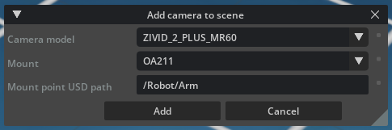
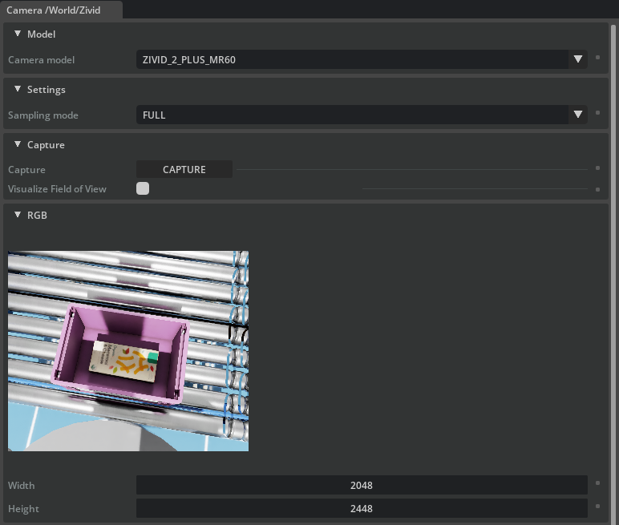

# Zivid 3D Cameras Extension for NVIDIA Isaac Sim

This is the official Isaac Sim extension for [Zivid 3D cameras](https://www.zivid.com/).

The extension provides realistic simulations of Zivid 3D cameras with accurate dimensions, masses, and camera intrinsics.

> **Note**
> This extension is experimental. API and GUI are subject to changes.

For more information on how to use the extension, check out our [Knowledge Base article](https://support.zivid.com/en/latest/api-reference/wrappers/isaac-sim.html).

![Zivid Image][header-image]

## Installation

1. Ensure you have a working [NVIDIA Isaac Sim installation]. The minimum version is **4.5.0**.

2. Clone the Zivid Isaac Sim repository:

    ```sh
    git clone https://github.com/zivid/zivid-isaac-sim
    ```

3. Follow the [official instructions] on how to install and enable extensions
   in Isaac Sim.

## Getting started

### Adding a Camera to Your Scene

There are two ways to add a Zivid camera to your scene:

1. **Using the Create Menu**:
   - Navigate to the "Create" menu in the top menu bar.
   - Select the option to add a Zivid camera to the scene. You can also add Zivid calibration boards from this menu.

2. **Using the Context Menu**:
   - Right-click on a rigid body prim in the scene hierarchy.
   - Select the option to add a Zivid Camera.
     Note that this option is only available for rigid body prims with a parent or ancestor that has articulation (typically robots).

### Camera Configuration

When adding a Zivid Camera, a configuration window appears where you can:

- Select the camera model
- Choose a mounting option (or no mount)
- Specify the path to the mount point prim



> **Note**: When using no mount, the camera pose may be off by 90 degrees and require manual adjustment.

### Interacting with Cameras

Once a Zivid camera is present in your scene, a new menu bar option will be available to interact with your camera.

Selecting a camera opens a docked window where you can:

- Change the camera model
- Configure camera settings
- Capture simulated point clouds



## Support

For more information about the Zivid cameras, please visit our [Knowledge Base](https://support.zivid.com/latest).
If you encounter any issues or have questions, please [open an issue](https://github.com/zivid/zivid-isaac-sim/issues) on our GitHub repository.

## License

Zivid Samples are distributed under the [BSD license](https://github.com/zivid/zivid-halcon-samples/tree/master/LICENSE).

[NVIDIA Isaac Sim installation]: https://docs.isaacsim.omniverse.nvidia.com/4.5.0/installation/index.html
[official instructions]: https://docs.isaacsim.omniverse.nvidia.com/4.5.0/utilities/updating_extensions.html
[header-image]: https://www.zivid.com/hubfs/softwarefiles/images/zivid-generic-github-header.png
