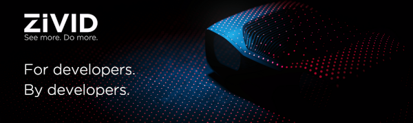

# Zivid 3D Cameras extension

This is the official Isaac Sim extension for
[Zivid 3D cameras](https://www.zivid.com/).

This extension adds the ability to add realistic simulations of Zivid 3D
cameras to your simulation with correct dimensions, masses and camera
intrinsics.

> [!WARNING]
> This extension is experimental. API and GUI are subject to changes.

For more information on installation and usage, consult the [top-level README]
in this extension's GitHub repository.

[top-level README]: https://github.com/zivid/zivid-isaac-sim/blob/master/README.md
